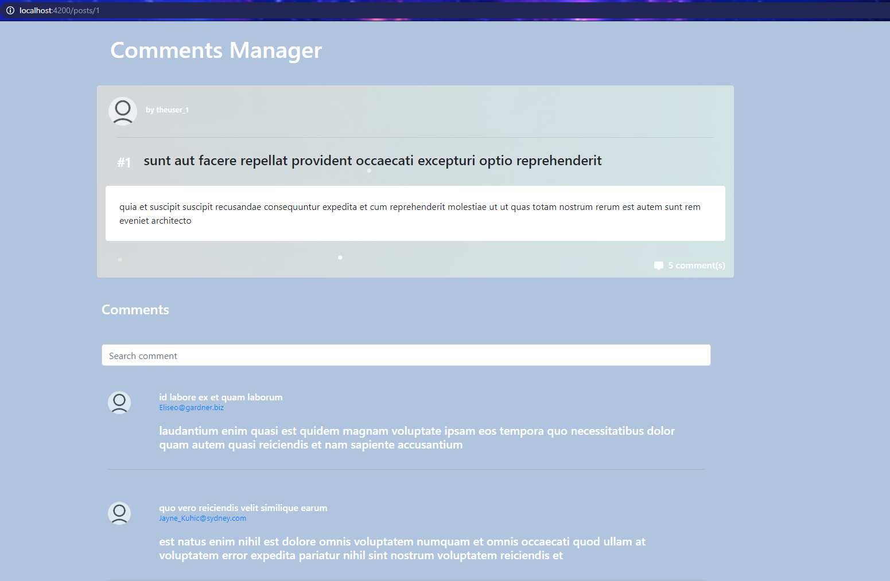

# CommentsManager

To meet with following requirement

1. Create a screen to display all the posts

View all posts endpoint: https://jsonplaceholder.typicode.com/posts
2. Create a second screen that shows all the comments related to a post

3. View individual post endpoint: https://jsonplaceholder.typicode.com/posts/{post_id}
4. View comments for a post endpoint: https://jsonplaceholder.typicode.com/comments?postId=1
5. Add a search box that allows the user to filter the comments related to a post. The user should be able to filter the results based on the:

    - name
    - email
    - body

## Screenshot

1. Post list

2. Post Detail + comment

3. Comment search

*Note that there is no highlight placed in the actual UI and only shown in screenshot presentation, but it is definitely nice to have 

